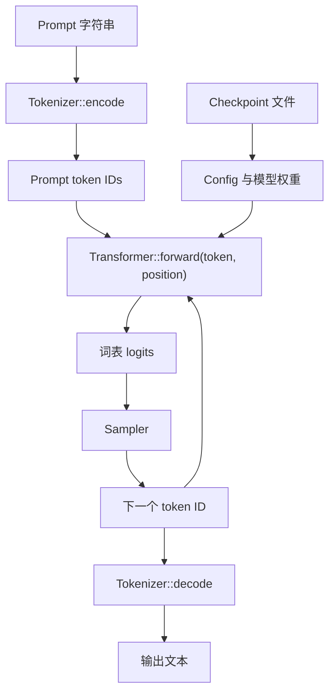

# Llama 2 推理 Runtime：从 FP32 到 Q8_0

本文系统梳理仓库中四个推理程序涉及的概念、架构、模块、算法与具体实现。

| 程序 | 语言 | Checkpoint | 线性层计算 | 定位 |
| --- | --- | --- | --- | --- |
| `run.c` | C | v0 FP32 | FP32 矩阵乘向量 | 上游 FP32 参考实现 |
| `run.cpp` | C++20 | v0 FP32 | FP32 矩阵乘向量 | 带 RAII 和边界检查的 C++ 参考实现 |
| `runq.c` | C | v2 Q8_0 | Q8 权重 × Q8 activation | 上游量化参考实现 |
| `runq.cpp` | C++20 | v2 Q8_0 | Q8 权重 × Q8 activation | 带 RAII 和边界检查的 C++ 量化实现 |

四个程序都是单进程、单请求、逐 token 的 CPU 推理程序。它们不是推理服务：没有动态批处理、请求调度、Paged KV Cache、GPU、Tensor Parallel 或分布式执行。

## 1. 整体链路



运行分为两个阶段：

1. Prompt 尚未消费完时，程序依次把 prompt token 强制送入模型，建立每层的 KV Cache。
2. Prompt 消费完后，Sampler 从 logits 选择下一个 token；该 token 又成为下一轮 `forward()` 的输入。

第一段通常称为 prompt processing 或 prefill，第二段称为 autoregressive decode。当前实现没有矩阵化 prefill kernel；两个阶段都逐 token 调用同一个 `forward()`。

## 2. 模型结构：层与 head 是两个维度

### 2.1 Transformer 层

一个 Transformer 层包含：

```text
输入 x
  -> Attention RMSNorm
  -> 一次多头 Attention
  -> Attention 残差相加
  -> MLP RMSNorm
  -> 一次 MLP / FFN
  -> MLP 残差相加
  -> 本层输出
```

模型按下面的顺序执行：

```text
Embedding
  -> Transformer 层 0：多头 Attention 0 -> MLP 0
  -> Transformer 层 1：多头 Attention 1 -> MLP 1
  -> Transformer 层 2：多头 Attention 2 -> MLP 2
  -> ...
  -> Final RMSNorm
  -> Wcls
  -> logits
```

不是“先执行所有 Attention，再执行所有 MLP”。每层的 Attention 和 MLP 使用该层自己的训练权重。

Llama 2 使用 Pre-Norm 和残差连接。一层可以写成：

$$
h = x + \operatorname{Attention}(\operatorname{RMSNorm}(x))
$$

$$
y = h + \operatorname{MLP}(\operatorname{RMSNorm}(h))
$$

本层的 $y$ 成为下一层的 $x$。

### 2.2 多头 Attention

一个 Transformer 层有一个多头 Attention 模块，但模块内部有多个并行 Query head。

例如 `n_layers = 6`、`n_heads = 8` 表示：

- 串行执行 6 个 Transformer 层；
- 每层都有一个多头 Attention；
- 每个 Attention 内部有 8 个 Query head；
- 每层都有独立的 Wq、Wk、Wv、Wo 和 MLP 权重。

### 2.3 存储顺序不等于执行顺序

Checkpoint 可以先连续存所有层的 Wq，再存所有层的 Wk，最后再存 MLP 权重。这只是磁盘布局；运行时仍然是：

```text
第 0 层 Attention -> 第 0 层 MLP
第 1 层 Attention -> 第 1 层 MLP
...
```

## 3. Config 与核心维度

`Config` 保存模型架构：

| 字段 | 含义 |
| --- | --- |
| `dim` | Residual stream 和 token 表征的宽度 |
| `hidden_dim` | MLP 中间表示的宽度 |
| `n_layers` | Transformer 层数 |
| `n_heads` | 每层 Attention 的 Query head 数量 |
| `n_kv_heads` | 每层 Attention 的 Key/Value head 数量 |
| `vocab_size` | 词表大小，也是 logits 数量 |
| `seq_len` | KV Cache 能保存的最大 token 位置数 |

代码使用两个派生维度：

$$
\mathrm{head\_size}=\frac{\mathrm{dim}}{\mathrm{n\_heads}}
$$

$$
\mathrm{kv\_dim}=\mathrm{head\_size}\times\mathrm{n\_kv\_heads}
$$

`Config::validate()` 检查所有维度为正、head 可整除、GQA 可均匀分组，以及 RoPE 所需的偶数 head 宽度。

### 3.1 MHA、GQA 与 MQA

| 结构 | 条件 | KV 共享方式 |
| --- | --- | --- |
| MHA | `n_kv_heads == n_heads` | 每个 Query head 使用自己的 KV head |
| GQA | `1 < n_kv_heads < n_heads` | 一组 Query heads 共享一个 KV head |
| MQA | `n_kv_heads == 1` | 全部 Query heads 共享一个 KV head |

映射关系：

```text
queries_per_kv_head = n_heads / n_kv_heads
kv_head = query_head / queries_per_kv_head
```

这些数量由模型设计与训练决定，推理只从 Config 读取。减少 KV heads 会减少 Wk/Wv 参数和 KV Cache 大小。

## 4. 工程模块与职责

### 4.1 MappedFile

`MappedFile` 管理 checkpoint 的只读内存映射：

```text
open
  -> fstat 获取文件大小
  -> mmap(PROT_READ, MAP_PRIVATE)
  -> 关闭文件描述符
  -> 析构时 munmap
```

`mmap` 建立文件与虚拟地址空间之间的映射，并不等于立即把整个模型复制到物理内存。操作系统按需加载页面。权重 span 直接指向映射，所以映射必须比所有权重视图活得更久。

`Transformer` 中成员顺序为 `MappedFile -> Config -> TransformerWeights -> RunState`。C++ 成员按相反顺序析构，因此权重视图先失效，最后才解除文件映射。

### 4.2 WeightCursor

`WeightCursor` 按 checkpoint 规定的顺序切出权重并检查截断。它不分配、不复制模型权重。

- `run.cpp` 的 v0 payload 全是 FP32，内部保存 `span<const float>`。
- `runq.cpp` 的 v2 payload 混有 FP32 norm、int8 权重和 FP32 scale，内部保存 `span<const byte>`，并提供 `take_fp32()` 与 `take_q80()`。

“按字节工作的 WeightCursor”只描述其偏移单位；项目中没有第二个 Cursor 类型。

### 4.3 TransformerWeights

`TransformerWeights` 保存训练权重的非拥有视图。

每个 Transformer 层的权重：

| 权重 | 形状 | 作用 |
| --- | --- | --- |
| `rms_att_weight` | `dim` | Attention 前 RMSNorm 的可学习缩放 |
| `wq` | `dim × dim` | 生成本层全部 Query heads |
| `wk` | `kv_dim × dim` | 生成本层全部 Key heads |
| `wv` | `kv_dim × dim` | 生成本层全部 Value heads |
| `wo` | `dim × dim` | 混合所有 head 的拼接输出 |
| `rms_ffn_weight` | `dim` | MLP 前 RMSNorm 的可学习缩放 |
| `w1` | `hidden_dim × dim` | SwiGLU gate 投影 |
| `w3` | `hidden_dim × dim` | SwiGLU up/value 投影 |
| `w2` | `dim × hidden_dim` | 将 MLP 结果投影回模型维度 |

全局权重：

| 权重 | 形状 | 作用 |
| --- | --- | --- |
| Token embedding | `vocab_size × dim` | token ID 映射到模型表征 |
| Final RMSNorm | `dim` | 归一化最后一层输出 |
| `wcls` | `vocab_size × dim` | 模型表征映射到词表 logits |

`wcls` 是 language-model head 的权重矩阵，不是 Softmax。它可以与 token embedding 共享同一份训练权重，这称为 weight tying。

### 4.4 RunState

`RunState` 拥有一次推理所需的全部可写内存。缓冲区在模型构造时分配，`forward()` 内不进行堆分配。

| 缓冲区 | 大小 | 含义 |
| --- | --- | --- |
| `x` | `dim` | 当前 residual stream |
| `xb`、`xb2` | `dim` | 分支和中间结果的复用缓冲区 |
| `hb`、`hb2` | `hidden_dim` | MLP 中间缓冲区 |
| `q` | `dim` | 当前 token 的全部 Query heads |
| `attention` | `n_heads × seq_len` | Softmax 前是 score，之后是权重 |
| `logits` | `vocab_size` | 下一个 token 的未归一化分数 |
| `key_cache` | `n_layers × seq_len × kv_dim` | 每层、每个历史位置的 Key |
| `value_cache` | 同上 | 每层、每个历史位置的 Value |

`key_at(layer, position)` 和 `value_at(layer, position)` 返回对应层与位置的 `kv_dim` 长度切片。C++ 实现让 Wk/Wv 直接写入 KV Cache，不经过独立 K/V 临时数组。

Q8 Runtime 额外增加：

| 缓冲区 | 大小 | 用途 |
| --- | --- | --- |
| `xq` | `dim` 个 Q8 值及 scale | 模型宽度 activation 的动态量化结果 |
| `hq` | `hidden_dim` 个 Q8 值及 scale | SwiGLU 结果进入 W2 前的量化结果 |

### 4.5 Transformer

`Transformer` 将 checkpoint 生命周期、Config、训练权重视图和运行时状态绑定成一个可执行模型。构造函数映射 checkpoint、解析配置和权重，再创建 RunState。

`forward(token, position)` 返回内部 logits 缓冲区的 span；下一次调用会覆盖该 span。Q8 版本额外保存 `group_size_`，以替代 `runq.c` 的全局 `GS`。

### 4.6 Tokenizer

Tokenizer 加载 `tokenizer.bin`。文件先保存最大 token 长度，随后为每个词表项保存：

```text
float score
uint32 byte_length
byte[byte_length] piece
```

编码步骤：

1. 按需插入 BOS，ID 为 1；
2. 对非空文本插入 SentencePiece dummy prefix；
3. 按 UTF-8 code point 查词表；
4. 找不到时执行 byte fallback，即 `unsigned_byte + 3`；
5. 反复选择 score 最高的相邻 token pair 做 BPE 合并；
6. 按需插入 EOS，ID 为 2。

解码时查出 token piece，移除 BOS 后的 dummy prefix，并把 `<0x41>` 这类 byte token 恢复为原始字节。

### 4.7 Sampler

模型输出 logits，不是概率，也不是梯度。每个 logit 是一个候选词表 token 的未归一化分数。

Sampler 支持：

- `temperature == 0`：argmax，确定性选择最大 logit；
- `top_p <= 0` 或 `top_p >= 1`：对完整 Softmax 分布做 multinomial sampling；
- 其他情况：只在累计概率刚超过 `top_p` 的最小高概率集合内采样。

非零 temperature 时先计算：

$$
z_i'=\frac{z_i}{T}
$$

再做词表 Softmax。较低的正 temperature 使分布更尖锐，较高值使分布更平坦。显式指定 seed 时，xorshift64* 提供可复现的随机序列。

### 4.8 Options、generate 与 chat

`Options` 保存 CLI 参数。`generate()` 先强制喂入所有 prompt token，然后自回归采样。`chat()` 构造 Llama 2 instruction 模板，并让 position 在多轮对话中持续递增，使 KV Cache 保留历史。

它们不提供多用户或并发请求服务。一个进程持有一个模型实例和一份会话状态。

## 5. FP32 forward 的具体算法

`forward(token, position)` 一次处理一个 token。小于当前 position 的 KV Cache 必须已由此前调用填充。

### 5.1 Embedding

token ID 选择 embedding 矩阵的一行：

$$
x=E[\mathrm{token},:]
$$

所得 `dim` 长度向量成为 residual stream 的起点。

### 5.2 每个 Transformer 层

#### Attention 前归一化与 Q/K/V

$$
\hat{x}=\operatorname{RMSNorm}(x)
$$

$$
q=W_q\hat{x},\qquad k=W_k\hat{x},\qquad v=W_v\hat{x}
$$

Q、K、V 都来自同一个归一化后的当前 token 表征，但使用不同训练矩阵。当前 K/V 直接写入本层、本 position 的 KV Cache。Q 只在本次 Attention 中使用，因此不缓存。

#### RoPE

RoPE 在每个 Q/K head 内把相邻坐标组成二维对。对一对 $(a,b)$ 和位置相关角度 $\theta$：

$$
a'=a\cos(\theta)-b\sin(\theta)
$$

$$
b'=a\sin(\theta)+b\cos(\theta)
$$

V 不旋转。RoPE 改变 Q/K 点积，使 Attention 能表达相对位置。KV Cache 保存已经旋转过的 K。

#### Causal 多头 Attention

每个 Query head 用当前 Query 与位置 0 到当前 position 的所有兼容 Key 计算 score：

$$
\mathrm{score}_t=\frac{q\cdot k_t}{\sqrt{\mathrm{head\_size}}}
$$

代码不访问未来位置，因此无需显式构造 causal mask 矩阵。

稳定 Softmax 将 score 转换成权重：

$$
p_t=\frac{e^{\mathrm{score}_t-m}}{\sum_j e^{\mathrm{score}_j-m}},
\qquad m=\max_j\mathrm{score}_j
$$

同一块 `attention` 内存先存 score，调用 Softmax 后再存 $p_t$。一个 Query head 的输出是历史 Value 的加权和：

$$
o=\sum_{t=0}^{\mathrm{position}}p_t v_t
$$

每个 head 把输出写入 `xb` 中自己的连续片段，因此 `xb` 已经是所有 head 的拼接结果。随后 Wo 混合不同 head 的信息：

$$
x\leftarrow x+W_o\operatorname{Concat}(o_0,o_1,\ldots)
$$

#### MLP / FFN / SwiGLU

在本项目中，MLP 和 FFN 指同一个 Transformer 子层；FFN 全称 Feed-Forward Network。

$$
g=W_1\operatorname{RMSNorm}(x)
$$

$$
u=W_3\operatorname{RMSNorm}(x)
$$

$$
\operatorname{MLP}(x)=W_2\left(\operatorname{SiLU}(g)\odot u\right)
$$

其中 $\odot$ 是逐元素乘法，且：

$$
\operatorname{SiLU}(z)=z\sigma(z)=\frac{z}{1+e^{-z}}
$$

W1 和 W3 将 `dim` 扩展到 `hidden_dim`；W2 再投影回 `dim`，然后执行第二次残差相加。

### 5.3 Final RMSNorm 与 Wcls

所有 Transformer 层结束后：

$$
\mathrm{logits}=W_{\mathrm{cls}}\operatorname{RMSNorm}(x)
$$

只有随机采样需要概率时才执行词表 Softmax；greedy argmax 不需要。

## 6. FP32 kernels

### 6.1 rms_norm

对长度为 $N$ 的向量：

$$
y_i=w_i\frac{x_i}{\sqrt{\frac{1}{N}\sum_jx_j^2+10^{-5}}}
$$

与 LayerNorm 不同，RMSNorm 不减均值。

### 6.2 matmul

该函数实际执行矩阵乘向量。行优先的 `rows × columns` 矩阵乘长度为 `columns` 的向量，输出长度为 `rows`：

$$
y_r=\sum_{c=0}^{\mathrm{columns}-1}W_{r,c}x_c
$$

它是大模型推理的主要计算热点。当前 C++ reference 使用普通 CPU 标量循环，没有 BLAS、OpenMP、显式 SIMD 或 GPU kernel。

### 6.3 softmax_inplace

这里实现普通稳定三遍 Softmax，不是 Online Softmax：

1. 找最大值；
2. 将每项替换为 `exp(value - maximum)` 并累计总和；
3. 每项除以总和。

它既用于 Attention score，也用于随机采样前的词表 logits。

### 6.4 apply_rope

该 kernel 对每个 Q/K head 独立执行前述相邻坐标旋转。

## 7. Q8_0 Runtime

Q8 版本没有改变 Transformer 架构，只改变大矩阵权重和线性层的计算表示。RMSNorm、RoPE、Attention score、Softmax、Value 加权、KV Cache、残差、SwiGLU、线性层输出和 logits 仍是 FP32。

### 7.1 QuantizedTensor

`QuantizedTensor` 是只读、非拥有的量化数据视图：

```cpp
struct QuantizedTensor {
  std::span<const std::int8_t> values;
  std::span<const float> scales;
};
```

它通常指向 MappedFile 中的权重。类型名没有 `View`，但两个 span 明确表示它不拥有数据。

### 7.2 QuantizedBuffer 与 view()

`QuantizedBuffer` 拥有运行时动态量化 activation 的可写 vector：

```cpp
struct QuantizedBuffer {
  std::vector<std::int8_t> values;
  std::vector<float> scales;

  QuantizedTensor view() const noexcept {
    return {values, scales};
  }
};
```

`view()` 不复制数据，只创建两个只读 span。这样 `matmul_q80()` 能以同一个 `QuantizedTensor` 接口读取 checkpoint 权重和动态量化 activation，而不需要两个重载。

### 7.3 分组对称量化

每组连续 $G$ 个 FP32 数值共享一个 scale：

$$
s=\frac{\max_i|x_i|}{127}
$$

$$
q_i=\operatorname{clamp}\left(\operatorname{round}(x_i/s),-127,127\right)
$$

反量化关系：

$$
x_i\approx q_i s
$$

`quantize_q80()` 用于运行时 activation。全零 group 被编码成零 scale 和全零 values，避免 `0/0`。`dequantize_q80()` 主要用于恢复当前 token 的 embedding 行。

当 $G=64$ 时：

```text
FP32：64 × 4 = 256 bytes
Q8_0：64 × 1 + 1 × 4 = 68 bytes
压缩比：约 3.76 倍
```

### 7.4 Q8 矩阵乘向量

对输出行 $r$ 和量化组 $g$，先计算 int8 整数点积：

$$
I_{r,g}=\sum_{k\in g}q^W_{r,k}q^x_k
$$

再乘权重 scale 与 activation scale：

$$
y_r=\sum_g I_{r,g}s^W_{r,g}s^x_g
$$

组内使用 `int32_t` 累加，跨组和最终输出使用 FP32。因为 $127\times127\times64$ 约为一百万，`int16_t` 不够，`int32_t` 足够。

### 7.5 Q8 forward 的变化

与 FP32 路径相比，只在线性层周围增加量化或反量化：

```text
选中的 Q8 embedding 行
  -> dequantize_q80
  -> FP32 x

Attention RMSNorm
  -> quantize_q80(xq)
  -> Wq/Wk/Wv 三次 Q8 matmul 共用 xq
  -> FP32 RoPE 与 Attention
  -> quantize_q80(xq)
  -> Wo Q8 matmul
  -> FP32 残差

MLP RMSNorm
  -> quantize_q80(xq)
  -> W1/W3 两次 Q8 matmul 共用 xq
  -> FP32 SwiGLU
  -> quantize_q80(hq)
  -> W2 Q8 matmul
  -> FP32 残差

Final RMSNorm
  -> quantize_q80(xq)
  -> Wcls Q8 matmul
  -> FP32 logits
```

`runq.c` 启动时反量化整个 embedding 表。`runq.cpp` 只反量化当前 token 使用的一行，从而避免常驻一份完整 FP32 embedding 副本。Wk/Wv 直接写入 FP32 KV Cache，省去临时 K/V 和两次复制。

## 8. Checkpoint 格式

### 8.1 v0 FP32

`run.c` 和 `run.cpp` 读取 legacy v0：

```text
Config：7 个 int32
FP32 token embedding
FP32 权重，按 legacy export 顺序
两张 legacy RoPE 表；runtime 跳过并动态计算 RoPE
可选 FP32 Wcls
```

`vocab_size` 的正负号编码 Wcls 是否共享 embedding。读取后 runtime 将其恢复为正的真实词表大小。

### 8.2 v2 Q8_0

`runq.c` 和 `runq.cpp` 要求 256-byte v2 header：

| Offset | 类型 | 含义 |
| ---: | --- | --- |
| 0 | `uint32` | Magic `0x616b3432` |
| 4 | `int32` | Version 2 |
| 8 | 7 个 `int32` | Config |
| 36 | `uint8` | Wcls 是否共享 embedding |
| 37 | `int32` | 量化 group size |
| 41..255 | bytes | 保留 padding |

Payload 先存三组 FP32 norm 权重，再存 Q8 tensors。每个 Q8 tensor 的布局是全部 int8 values，随后是全部 FP32 scales。

每层量化矩阵独立保存，因此 C++ 使用 `vector<QuantizedTensor>` 保存每层的小视图。vector 不复制实际权重。

Header 使用固定 offset 和 `memcpy` 读取，不把文件强转为 C++ Header struct。group size 从未对齐的 offset 37 开始，C++ struct padding 可能改变布局。

### 8.3 导出 checkpoint

导出 legacy v0 FP32：

```bash
python export.py model.bin --checkpoint out/ckpt.pt
```

导出 v2 Q8_0：

```bash
python export.py model_q80.bin --version 2 --checkpoint out/ckpt.pt
```

也可使用 `--meta-llama` 或 `--hf` 输入；运行 `python export.py --help` 查看参数。v0 文件不能交给 Q8 runtime，v2 Q8 文件也不能交给 v0 FP32 runtime。

## 9. C 与 C++ 实现映射

C 程序中的函数可以按职责分成以下模块：

| C 函数 | 所属模块 | 具体职责 | C++ 对应 |
| --- | --- | --- | --- |
| `malloc_run_state` | 运行时内存 | 分配 activation、Attention、logits 与 KV Cache | `RunState` 构造函数 |
| `free_run_state` | 运行时内存 | 释放全部运行时缓冲区 | `vector` 析构 |
| `memory_map_weights` | 模型加载 | 按磁盘顺序把裸指针指向各权重区域 | `read_checkpoint` 与 `WeightCursor` |
| `read_checkpoint` | 模型加载 | 读取 Config/header、映射文件、解析权重 | `MappedFile` 与 `read_checkpoint` |
| `build_transformer` | 模型生命周期 | 组合 Config、权重与 RunState | `Transformer` 构造函数 |
| `free_transformer` | 模型生命周期 | 解除映射并释放所有内存 | RAII 析构 |
| `rmsnorm` | 数值 kernel | 执行 RMSNorm | `kernel::rms_norm` |
| `softmax` | 数值 kernel | 执行稳定 Softmax | `kernel::softmax_inplace` |
| `matmul` | 数值 kernel | FP32 或 Q8 矩阵乘向量 | `kernel::matmul` 或 `kernel::matmul_q80` |
| `forward` | 模型执行 | 组织 embedding、所有 Transformer 层和 Wcls | `Transformer::forward` |
| `build_tokenizer` | Tokenizer | 读取词表文件 | `Tokenizer` 构造函数 |
| `str_lookup` | Tokenizer | 在排序词表中二分查找 piece | `Tokenizer::lookup` |
| `encode` | Tokenizer | UTF-8、byte fallback 与 BPE 合并 | `Tokenizer::encode` |
| `decode` | Tokenizer | token ID 转换为输出 piece | `Tokenizer::decode` |
| `safe_printf` | 输出 | 过滤不可打印的单字节控制字符 | `safe_print` |
| `sample_argmax` | Sampler | Greedy 选择 | `Sampler::sample_argmax` |
| `sample_mult` | Sampler | 完整分布 multinomial sampling | `Sampler::sample_mult` |
| `sample_topp` | Sampler | Nucleus/top-p sampling | `Sampler::sample_topp` |
| `random_u32/f32` | Sampler | xorshift64* 随机数 | `Sampler::random_u32/f32` |
| `generate` | 控制流 | Prompt processing 与自回归生成循环 | `generate` |
| `read_stdin` | 控制流 | 读取交互输入 | `read_line` |
| `chat` | 控制流 | Llama 2 chat 模板与多轮状态机 | `chat` |
| `main` | CLI | 解析参数、创建组件并选择模式 | `Options`、`parse_options` 与 `main` |

`runq.c` 还增加四个量化相关函数：

| `runq.c` 函数 | 作用 | `runq.cpp` 对应 |
| --- | --- | --- |
| `quantize` | FP32 activation 动态量化为 Q8_0 | `kernel::quantize_q80` |
| `dequantize` | Q8_0 恢复为 FP32 | `kernel::dequantize_q80` |
| `init_quantized_tensors` | 用裸指针描述 values/scales 区域 | `WeightCursor::take_q80` |
| Q8 `matmul` | int8 点积、scale 恢复和 FP32 输出 | `kernel::matmul_q80` |

整体工程表示的对应关系如下：

| C 实现 | C++ 实现 | 作用 |
| --- | --- | --- |
| Transformer 中的裸 mmap 字段 | `MappedFile` | RAII 管理映射生命周期 |
| `memory_map_weights` 裸指针移动 | `WeightCursor` | 有边界的权重切片 |
| `malloc_run_state/free_run_state` | `RunState` vector | 自动管理可写缓冲区 |
| `float*` 权重 | `span<const float>` | 带长度的非拥有视图 |
| C `QuantizedTensor` 裸指针 | C++ `QuantizedTensor` span | 同一量化概念，增加长度 |
| 手动分配 xq/hq | `QuantizedBuffer` | 可写量化内存所有者 |
| 全局 `GS` | `Transformer::group_size_` | 显式的单模型状态 |
| 临时 K/V 后 memcpy | Wk/Wv 直接写 KV Cache | 消除两次复制 |
| 整张 embedding 反量化 | 按 token 反量化一行 | 减少常驻内存 |
| 出错时 `exit()` | exception 在 `main()` 捕获 | 出错路径也自动清理资源 |

C++ 类改善的是所有权、接口边界与错误处理，不是增加 GPU、服务化或分布式功能。`span` 和量化权重描述符都不复制模型数据。

## 10. 复杂度、内存与性能边界

对位置 $T$ 的一个新 token：

- 线性层计算量主要由模型参数量决定；
- Attention 读取从 0 到 $T$ 的 K/V，因此单个 decode token 的 Attention 工作量随上下文长度线性增长；
- FP32 KV Cache 占用为 `2 × n_layers × seq_len × kv_dim × sizeof(float)`；
- Q8_0 减少大矩阵权重的文件大小与内存带宽，但没有量化 KV Cache。

当前 kernels 是 CPU 标量 reference。Q8 缩小存储并不自动等于最佳 CPU 性能；生产 CPU 实现通常还需要线程和 SIMD，生产 GPU 推理则使用不同的 kernel 和调度体系。这些优化不属于当前项目边界。

## 11. 构建与运行

构建 C 版本：

```bash
make run
```

该 target 同时生成 `run` 和 `runq`。

构建 C++ 版本：

```bash
make runcpp
make runqcpp
```

运行 v0 FP32：

```bash
./run_cpp stories15M.bin -i "Once upon a time" -t 0 -n 128
```

运行 v2 Q8_0：

```bash
./runq_cpp model_q80.bin -i "Once upon a time" -t 0 -n 128
```

CLI 参数：

| 参数 | 含义 |
| --- | --- |
| `-z PATH` | tokenizer binary 路径 |
| `-i TEXT` | 初始 prompt |
| `-n N` | 最大总 position 数 |
| `-t T` | temperature；零表示 greedy |
| `-p P` | top-p 阈值 |
| `-s SEED` | 随机种子 |
| `-m generate\|chat` | 运行模式 |
| `-y TEXT` | Chat 模式的 system prompt |

`-n` 同时计算 prompt processing 和生成 token，并被限制在 checkpoint 的 `seq_len` 内。

## 12. 当前验证与明确边界

当前 C++ 实现已验证：

- C++20 严格编译；
- v0 FP32 真实 TinyStories checkpoint；
- v2 Q8_0 真实多层 TinyStories checkpoint；
- MHA 与 GQA；
- shared 和 unshared Wcls；
- greedy 与普通 multinomial 对照；
- AddressSanitizer 和 UndefinedBehaviorSanitizer。

当前明确不实现：

- GPU kernel 或 FlashAttention；
- batch、continuous batching 或多并发请求；
- 网络/API 服务；
- Paged KV Cache；
- Tensor/Pipeline/Data Parallel；
- speculative decoding；
- quantized KV Cache；
- v0/v2 自动转换或统一加载。

本项目的目标是让从序列化权重到生成文本的完整推理路径保持可读，而不是成为生产级推理服务。
