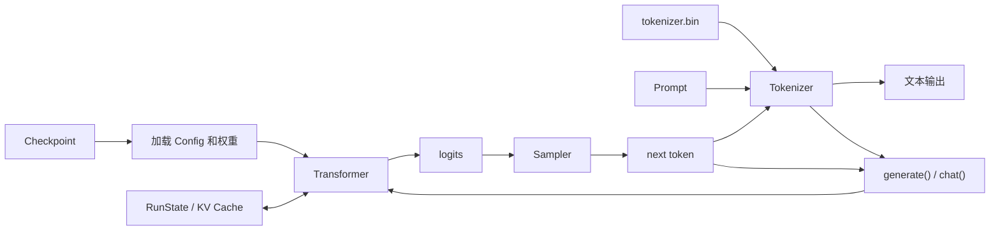

# Llama 2 CPU 推理运行时

本仓库提供四个单文件 CPU 推理程序。它们加载 checkpoint，逐 token 执行 Llama 2 forward，并把 logits 转为后续文本。

| 程序 | 语言 | Checkpoint | 线性层 |
| --- | --- | --- | --- |
| `run.c` | C | legacy v0 | FP32 |
| `run.cpp` | C++20 | legacy v0 | FP32 |
| `runq.c` | C | v2 | Q8_0 |
| `runq.cpp` | C++20 | v2 | Q8_0 |

这些程序实现同一计算图。C++ 版本增加所有权管理和边界检查，不增加模型层或加速后端。

## 整体架构



Checkpoint 提供模型配置和训练权重。Tokenizer 在文本与 token ID 之间转换。Transformer 使用当前 token 和 KV Cache 计算 logits。Sampler 选择下一个 token，该 token 随后进入下一轮。

## 运行 FP32 C++ 版本

在仓库根目录下载 legacy v0 checkpoint，然后构建 `run_cpp`。该流程需要 `curl`、`make` 和支持 C++20 的编译器。

```bash
curl -L \
  https://huggingface.co/karpathy/tinyllamas/resolve/main/stories15M.bin \
  -o stories15M.bin

make runcpp

./run_cpp stories15M.bin \
  -z tokenizer.bin \
  -i "Once upon a time" \
  -t 0 \
  -n 32
```

`-t 0` 选择最大 logit，因此不使用随机采样。`-n 32` 限制总 position 数，Prompt 也计入其中。

程序把文本写到标准输出，把 `achieved tok/s` 写到标准错误。

`stories15M.bin` 约为 60 MB。名称中的 `15M` 表示参数量，不表示文件大小。该文件不能交给 `runq` 或 `runq_cpp`。

## 选择与 checkpoint 匹配的程序

FP32 程序只读取 v0。Q8_0 程序只读取 v2。程序不会自动转换格式。

| 命令 | 输出 | 用途 |
| --- | --- | --- |
| `make` 或 `make run` | `run`、`runq` | 构建两个 C 程序 |
| `make runcpp` | `run_cpp` | 构建 C++ FP32 程序 |
| `make runqcpp` | `runq_cpp` | 构建 C++ Q8_0 程序 |
| `make rundebug` | `run`、`runq` | 构建 C 调试版本 |
| `make runcppdebug` | `run_cpp` | 构建 C++ FP32 调试版本 |
| `make runfast` | `run`、`runq` | 使用 `-Ofast` 构建 C 程序 |
| `make runcppfast` | `run_cpp` | 使用 `-ffast-math` 构建 C++ FP32 程序 |
| `make runomp` | `run`、`runq` | 使用 OpenMP 构建 C 程序 |

`runomp` 不构建 C++ 程序。C++ kernel 没有 OpenMP、BLAS 或显式 SIMD。Fast-math 可能改变浮点结果。

## 文本按同一循环生成

生成路径依次调用 Tokenizer、Transformer 和 Sampler：

```text
Prompt text
  -> encode
  -> Prompt token IDs
  -> forward(token, position)
  -> logits
  -> 强制选择下一个 Prompt token，或采样一个 token
  -> decode and print
  -> 下一次 forward
```

生成分为两个阶段。

### 1. Prompt processing

Prompt 尚未消费完时，程序强制选择下一个 Prompt token，不使用 Sampler 的选择结果。

```text
当前 Prompt token
  -> forward(token, position)
  -> 写入每层当前位置的 K/V
  -> 产生 logits
  -> 强制选择下一个 Prompt token
```

该阶段用于建立 Prompt 对应的 KV Cache，通常也称为 prefill。

当前实现没有矩阵化 prefill。程序仍然逐 token 调用 `forward()`。

### 2. Autoregressive decode

Prompt 消费完后，Sampler 才从 logits 中选择下一个 token。

```text
当前 token
  -> forward(token, position)
  -> 更新每层 KV Cache
  -> 产生 logits
  -> Sampler 选择 next token
  -> decode and print
  -> next token 进入下一轮 forward()
```

两个阶段共用同一个 `forward()`。区别只在于下一个 token 的来源：

| 阶段 | 下一个 token 来源 |
| --- | --- |
| Prompt processing | 已知 Prompt |
| Autoregressive decode | Sampler |

每次调用都会写入当前位置的 KV Cache。下一次调用会读取此前位置的 K/V。

Position 必须从 0 递增，并且小于 `seq_len`。`forward()` 只检查取值范围，不检查 position 是否连续。

## 区分 Transformer 层和 Attention head

`n_layers` 表示 Transformer 层数。`n_heads` 表示每层 Attention 的 Query head 数量。两者描述不同的结构。

每层执行完整的 Attention 和 MLP：

```text
输入 x
  -> Attention RMSNorm
  -> Q/K/V 投影、RoPE 和多头 Attention
  -> Wo 投影和残差相加
  -> MLP RMSNorm
  -> SwiGLU MLP 和残差相加
  -> 本层输出
```

整个模型逐层执行：

```text
Embedding
  -> Layer 0: Attention -> MLP
  -> Layer 1: Attention -> MLP
  -> ...
  -> Final RMSNorm
  -> Wcls
  -> logits
```

模型不会先执行所有 Attention，再执行所有 MLP。每层使用自己的训练权重。

Checkpoint 按权重类型存放所有层的数据。这种磁盘顺序不改变执行顺序。

例如，`n_layers = 6` 且 `n_heads = 8` 表示模型串行执行 6 层。每层包含一个多头 Attention，该 Attention 内部包含 8 个 Query head。

## Config 定义模型尺寸

四个程序读取相同的七个配置字段。

| 字段 | 含义 |
| --- | --- |
| `dim` | residual stream 宽度 |
| `hidden_dim` | SwiGLU 中间宽度 |
| `n_layers` | Transformer 层数 |
| `n_heads` | 每层 Query head 数 |
| `n_kv_heads` | 每层 Key/Value head 数 |
| `vocab_size` | 词表和 logits 大小 |
| `seq_len` | 最大 position 和 KV Cache 容量 |

Residual stream 是层与层之间传递的主干向量。Attention 和 MLP 都通过残差连接更新该向量。

运行时计算：

$$
\mathrm{head\_size}
=
\frac{\mathrm{dim}}
{\mathrm{n\_heads}}
$$

$$
\mathrm{kv\_dim}
=
\mathrm{dim}
\frac{\mathrm{n\_kv\_heads}}
{\mathrm{n\_heads}}
$$

C++ Reader 要求：

- 所有字段为正；
- `dim` 能被 `n_heads` 整除；
- `n_heads` 能被 `n_kv_heads` 整除；
- `head_size` 为偶数。

Q8 C++ Reader 还要求 `dim` 和 `hidden_dim` 能被量化 group size 整除。

C Reader 没有等价的集中校验。

## MHA、GQA 和 MQA

| 结构 | 条件 | KV 关系 |
| --- | --- | --- |
| MHA | `n_kv_heads == n_heads` | 每个 Query head 使用独立 KV head |
| GQA | `1 < n_kv_heads < n_heads` | 一组 Query head 共享一个 KV head |
| MQA | `n_kv_heads == 1` | 所有 Query head 共享一个 KV head |

GQA 是 Grouped-Query Attention。它让一组 Query head 共用一个 Key/Value head。

运行时按以下关系为 Query head 选择 K/V：

```text
queries_per_kv_head = n_heads / n_kv_heads
kv_head = query_head / queries_per_kv_head
```

共享 K/V 不会共享 Query 或 Attention 输出。减少 KV head 会缩小 Wk、Wv 和 KV Cache。

这些数量由模型结构和训练权重决定，推理阶段不能任意修改。

## Forward 一次处理一个 token

`forward(token, position)` 先读取一行 embedding：

$$
x=E[\mathrm{token},:]
$$

随后每层先执行 Attention，再执行 MLP。最后一层之后，Runtime 计算词表 logits。

完整执行路径为：

```text
token ID
  -> 选择 embedding 行

对每个 Transformer Layer:
  -> Attention RMSNorm
  -> Wq / Wk / Wv
  -> Q/K RoPE
  -> 当前 K/V 写入 KV Cache
  -> Q 与历史 K 计算 score
  -> Softmax
  -> 历史 V 加权
  -> 拼接 head 输出
  -> Wo
  -> Attention residual
  -> MLP RMSNorm
  -> W1 / W3
  -> SwiGLU
  -> W2
  -> MLP residual

所有层完成:
  -> Final RMSNorm
  -> Wcls
  -> logits
```

### Attention 写入当前 K/V

每层先执行 RMSNorm，再计算三个独立投影：

$$
\hat{x}
=
\operatorname{RMSNorm}(x)
$$

$$
q=W_q\hat{x},
\qquad
k=W_k\hat{x},
\qquad
v=W_v\hat{x}
$$

Q、K 和 V 来自同一个归一化后的输入，但使用不同训练权重：

- Query 表示当前 token 要查询什么。
- Key 表示当前 token 可以如何被匹配。
- Value 表示该 token 被关注后提供的内容。

Q 只用于当前调用。

K/V 会被未来 token 使用，因此写入当前层、当前位置的 KV Cache。

### RoPE 处理 Q 和 K

RoPE 是 Rotary Position Embedding。它旋转每个 Q/K head 中的相邻坐标：

$$
a'
=
a\cos(\theta)-b\sin(\theta)
$$

$$
b'
=
a\sin(\theta)+b\cos(\theta)
$$

角度由 position 和坐标频率决定。

V 不旋转。KV Cache 保存旋转后的 K。

Runtime 固定使用 RoPE base `10000`。Checkpoint 不保存 `rope_theta` 或 `rope_scaling`。

### Attention 读取当前及历史位置

每个 Query head 遍历位置 0 到当前 position：

$$
\mathrm{score}_t
=
\frac{q\cdot k_t}
{\sqrt{\mathrm{head\_size}}}
$$

Runtime 不读取未来位置，因此不创建显式 causal mask 矩阵。

稳定 Softmax 将 score 转换为权重：

$$
p_t
=
\frac{
\exp(\mathrm{score}_t-m)
}{
\sum_j\exp(\mathrm{score}_j-m)
}
$$

其中：

$$
m
=
\max_j\mathrm{score}_j
$$

一个 head 的输出是历史 Value 的加权和：

$$
o
=
\sum_{t=0}^{\mathrm{position}}
p_t v_t
$$

`attention` 缓冲区先保存 score，执行 Softmax 后复用同一块内存保存权重。

当前实现使用普通三遍稳定 Softmax，不实现 Online Softmax，也不是 FlashAttention。

### Wo 混合各个 head

各个 head 的输出连续写入 `xb`，形成拼接结果。

Wo 是 Attention 的输出投影权重：

$$
x
\leftarrow
x+
W_o\operatorname{Concat}(o_0,o_1,\ldots)
$$

Wo 混合不同 head 产生的特征，然后执行第一次残差相加。

Wo 不属于 MLP，也不是 Wcls。

### MLP 使用 SwiGLU

Attention 残差结果首先执行第二次 RMSNorm：

$$
\hat{h}
=
\operatorname{RMSNorm}(h)
$$

随后计算 W1 和 W3 两个分支：

$$
g=W_1\hat{h}
$$

$$
u=W_3\hat{h}
$$

SiLU 激活函数为：

$$
\operatorname{SiLU}(z)
=
\frac{z}{1+e^{-z}}
$$

SwiGLU MLP 为：

$$
x
\leftarrow
h+
W_2
\left(
\operatorname{SiLU}(g)\odot u
\right)
$$

$\odot$ 表示逐元素乘法。

W1 和 W3 从 `dim` 投影到 `hidden_dim`。W2 再投影回 `dim`，随后执行第二次残差相加。

在本文中，MLP 和 FFN 表示同一个 Transformer 子层。FFN 全称 Feed-Forward Network。

### Final projection 生成 logits

所有 Transformer 层完成后：

$$
\mathrm{logits}
=
W_{\mathrm{cls}}
\operatorname{RMSNorm}(x)
$$

Logit 是候选 token 的未归一化分数。它不是概率，也不是梯度。

Wcls 是训练权重，不是 Softmax。Checkpoint 可以让 Wcls 与 embedding 共享参数，该做法称为 weight tying。

只有随机采样需要概率时，Sampler 才对 logits 执行词表 Softmax。

### RMSNorm 使用固定 epsilon

RMSNorm 计算：

$$
y_i
=
w_i
\frac{x_i}
{
\sqrt{
\frac{1}{N}\sum_jx_j^2+10^{-5}
}
}
$$

RMSNorm 根据平方均值缩放向量，再乘训练得到的权重。它不减均值，因此不同于 LayerNorm。

Runtime 将 epsilon 固定为 `1e-5`。Checkpoint 不保存该值。

模型必须使用相同的 Transformer block、RMSNorm epsilon 和 RoPE 规则。形状匹配不足以兼容其他激活函数、其他位置编码、MoE 或滑动窗口模型。

## 权重和状态承担不同职责

Checkpoint 权重在加载后只读。`RunState` 保存每次 forward 改写的数据。

| 权重 | 每层形状 | 作用 |
| --- | --- | --- |
| `rms_att_weight` | `dim` | Attention 前 RMSNorm |
| `wq` | `dim × dim` | 生成 Query |
| `wk`、`wv` | `kv_dim × dim` | 生成 Key 和 Value |
| `wo` | `dim × dim` | 混合 head 输出 |
| `rms_ffn_weight` | `dim` | MLP 前 RMSNorm |
| `w1`、`w3` | `hidden_dim × dim` | 生成 SwiGLU 两个分支 |
| `w2` | `dim × hidden_dim` | 投影回 residual stream |

全局权重包括：

- token embedding；
- Final RMSNorm；
- Wcls。

| `RunState` 数据 | 大小 | 作用 |
| --- | ---: | --- |
| `x`、`xb`、`xb2` | 各 `dim` | residual stream 和临时结果 |
| `hb`、`hb2` | 各 `hidden_dim` | SwiGLU 两个分支 |
| `q` | `dim` | 当前 token 的 Query |
| `attention` | `n_heads × seq_len` | score 或 Softmax 权重 |
| `logits` | `vocab_size` | 下一 token 分数 |
| `key_cache`、`value_cache` | 各 `n_layers × seq_len × kv_dim` | 历史 K/V |
| `xq`、`hq` | Q8 C++ 专用 | 动态量化后的 activation |

这些缓冲区在模型构造时分配。`forward()` 的正常路径复用它们。

下一次 `forward()` 会覆盖之前返回的 logits，调用者不能长期保存该非拥有视图。

## C++ 类型明确数据所有权

| 类型 | 所有权 | 职责 |
| --- | --- | --- |
| `MappedFile` | 拥有映射 | 只读映射 Checkpoint，并在析构时解除映射 |
| `WeightCursor` | 不拥有 | 加载期间按格式切出权重 |
| `TransformerWeights` | 不拥有 | 保存 Checkpoint 中的权重视图 |
| `RunState` | 拥有 | 保存 vector 缓冲区和 KV Cache |
| `Transformer` | 拥有成员 | 组合映射、配置、权重视图和状态 |
| `Tokenizer` | 拥有 | 加载词表并编码、解码 |
| `Sampler` | 拥有 | 保存采样参数、随机状态和 top-p scratch |
| `QuantizedTensor` | 不拥有 | 引用 Q8 values 和 scales |
| `QuantizedBuffer` | 拥有 | 保存动态量化 activation |

`std::span` 只保存地址和长度，不复制或释放底层数据。

`WeightCursor` 只在 `read_checkpoint()` 中存在。加载完成后，`TransformerWeights` 保存指向 mmap 的非拥有视图。

`QuantizedBuffer::view()` 返回 `QuantizedTensor`，不复制 values 或 scales。

## FP32 和 Q8_0 使用同一模型结构

| 数据 | FP32 程序 | Q8_0 程序 |
| --- | --- | --- |
| 大矩阵权重 | FP32 | Checkpoint 中为 Q8_0 |
| 线性层输入 | FP32 | forward 时动态量化 |
| RMSNorm 权重 | FP32 | FP32 |
| Attention | FP32 | FP32 |
| KV Cache | FP32 | FP32 |
| residual stream | FP32 | FP32 |
| logits | FP32 | FP32 |
| Checkpoint | v0 | v2 |

Q8_0 将连续的 $G$ 个值作为一组。每组共享一个 FP32 scale，没有 zero point：

$$
s
=
\frac{\max_i|x_i|}{127}
$$

$$
q_i
=
\operatorname{clamp}
\left(
\operatorname{round}(x_i/s),
-127,
127
\right)
$$

反量化近似为：

$$
x_i
\approx
q_i s
$$

Q8 矩阵乘先计算 int8 点积，再应用权重和 activation 的 scale：

$$
y_r
=
\sum_g
\left(
\sum_{k\in g}
q^W_{r,k}q^x_k
\right)
s^W_{r,g}s^x_g
$$

组内使用 `int32_t` 累加，最终输出使用 FP32。

Q8 forward 为：

```text
Q8 embedding row
  -> dequantize
  -> FP32 x

Attention RMSNorm
  -> quantize xq
  -> Q8 Wq/Wk/Wv matvec
  -> FP32 Attention
  -> quantize xq
  -> Q8 Wo matvec
  -> FP32 residual

MLP RMSNorm
  -> quantize xq
  -> Q8 W1/W3 matvec
  -> FP32 SwiGLU
  -> quantize hq
  -> Q8 W2 matvec
  -> FP32 residual

Final RMSNorm
  -> quantize xq
  -> Q8 Wcls matvec
  -> FP32 logits
```

`runq.cpp` 对全零 activation group 写入零 scale 和零 values。它只反量化当前 token 的 embedding 行。

`runq.c` 在启动时反量化整张 embedding 表，并通过临时 K/V 再复制到 Cache。

Q8_0 减少权重读取量，但标量实现增加动态量化开销。较小的 Checkpoint 不保证更高的 token 速度。

## Checkpoint 版本不能互换

| 版本 | 数据 | Reader |
| --- | --- | --- |
| v0 | legacy FP32 | `run.c`、`run.cpp` |
| v1 | FP32，256-byte header | 当前没有 Reader |
| v2 | Q8_0，256-byte header | `runq.c`、`runq.cpp` |

所有版本使用本机整数、FP32 表示和字节序。格式没有 endian 转换、checksum、模型 ID 或 tensor 目录。

### v0 从 Config 开始

v0 没有 magic 或显式 version。

```text
Config: 7 × int32
token_embedding_table
all rms_att_weight
all Wq
all Wk
all Wv
all Wo
all rms_ffn_weight
all W1
all W2
all W3
rms_final_weight
legacy RoPE cosine table
legacy RoPE sine table
optional Wcls
```

`vocab_size` 的符号编码 weight tying：

- 正数：Wcls 共享 embedding；
- 负数：文件末尾保存独立 Wcls。

当前 forward 动态计算 RoPE。v0 Reader 仍跳过两张 legacy RoPE 表，以保持后续偏移正确。

v0 C++ Reader 检查截断和 FP32 对齐，但不拒绝尾随字节。v0 C Reader 主要依赖裸指针偏移。

### v1 只有 Exporter

v1 使用 magic `0x616b3432`、version 1 和 256-byte header。Payload 为 FP32，但顺序不同于 v0，并且不包含 legacy RoPE 表。

当前四个 Runtime 都不能读取 v1。

### v2 保存 Q8 values 和 scales

v2 Header 为：

| Offset | 类型 | 内容 |
| ---: | --- | --- |
| 0 | `uint32` | magic `0x616b3432` |
| 4 | `int32` | version 2 |
| 8 | 7 × `int32` | Config |
| 36 | `uint8` | shared classifier |
| 37 | `int32` | group size |
| 41–255 | bytes | padding |

Group size 位于未对齐的 offset 37。C++ Reader 使用 `memcpy` 读取该字段。

Payload 顺序为：

```text
all Attention RMSNorm
all MLP RMSNorm
Final RMSNorm

Q8 embedding
all Q8 Wq
all Q8 Wk
all Q8 Wv
all Q8 Wo
all Q8 W1
all Q8 W2
all Q8 W3
optional Q8 Wcls
```

每个 Q8 tensor 保存：

```text
int8[element_count] values
float[element_count / group_size] scales
```

v2 C++ Reader 检查 magic、version、尺寸和截断，但仍允许尾随字节。

## 导出 v0 或 v2

导出 v0：

```bash
python export.py model.bin \
  --version 0 \
  --checkpoint out/ckpt.pt
```

导出 v2：

```bash
python export.py model_q80.bin \
  --version 2 \
  --checkpoint out/ckpt.pt
```

当前 Exporter 存在以下限制：

- Hugging Face 导入没有正确读取 `num_key_value_heads`；
- Meta 导入将 `max_seq_len` 固定为 2048；
- v2 group size 只根据 `dim` 自动缩小；
- `--dtype` 参数传递存在错误；
- Q8 Exporter 没有全零 weight group 分支；
- v2 尺寸断言的错误信息引用未定义变量；
- legacy untied 导出会原地修改 `vocab_size`；
- 导出结果没有 checksum 或模型身份信息。

成功写出文件不证明模型语义一致。导出后应与源框架的 logits 或 greedy token 序列对照。

## Tokenizer 文件依赖 Checkpoint

Tokenizer binary 格式为：

```text
uint32 max_token_length

repeat vocab_size times:
  float score
  uint32 piece_length
  byte[piece_length] piece
```

Tokenizer 文件不保存 `vocab_size`。Runtime 从 Checkpoint Config 获取读取次数，因此两者必须配套。

编码顺序：

1. 按需插入 BOS 1。
2. 为非空文本插入 SentencePiece dummy prefix。
3. 按 UTF-8 code point 查词表。
4. 未命中时执行 `byte + 3` fallback。
5. 反复合并 score 最高的相邻 token pair。
6. 按需插入 EOS 2。

解码会移除 BOS 后的 dummy-prefix 空格，并将 `<0xHH>` 恢复为原始 byte。

该 Tokenizer 使用朴素重复扫描，不是高性能 SentencePiece 实现。

## Sampler 选择 next token

| 条件 | 行为 |
| --- | --- |
| `temperature == 0` | Argmax |
| `temperature > 0` 且 `top_p <= 0` 或 `top_p >= 1` | 完整分布 sampling |
| `temperature > 0` 且 `0 < top_p < 1` | Nucleus sampling |

非零 temperature 先缩放 logits：

$$
z_i'
=
\frac{z_i}{T}
$$

Top-p 丢弃不可能进入 nucleus 的低概率项，再按概率排序。它从累计概率首次超过 `top_p` 的前缀中采样。

随机采样使用 xorshift64*，并会把 logits 原地改成概率。

Seed 行为存在差异：

- C 的 `-s 0` 使用当前时间；
- C 的负 seed 转换为无符号值；
- C++ 将非正 seed 转为 0，再使用 `std::random_device` 生成非零状态。

## CLI 控制生成和 Chat

| 参数 | 默认值 | 作用 |
| --- | --- | --- |
| 第一个位置参数 | 无 | Checkpoint 路径 |
| `-z PATH` | `tokenizer.bin` | Tokenizer 文件 |
| `-i TEXT` | 空 | 初始 Prompt |
| `-n N` | 256 | 总 position 上限 |
| `-t T` | 1.0 | Temperature |
| `-p P` | 0.9 | Top-p |
| `-s SEED` | 自动 | 随机种子 |
| `-m MODE` | `generate` | `generate` 或 `chat` |
| `-y TEXT` | 空 | Chat system prompt |

`-n` 包含 Prompt processing 和生成位置。非正值或超过 `seq_len` 的值最终使用 `seq_len`。

负 temperature 会改为 0。范围外的 top-p 会改为 0.9。

所有 flag 必须带一个值。CLI 没有独立的 `--help` 分支。

C 使用 `atoi` 和 `atof`。C++ 拒绝无法完整解析、溢出或非有限的值。

Chat 使用 Llama 2 instruction 模板：

```text
[INST] <<SYS>>
system prompt
<</SYS>>

user prompt [/INST]
```

Assistant 生成 EOS 2 后开始下一轮。Generate 则把 BOS 1 作为终止标记。

C Chat 使用固定数组以及无边界的 `strcpy` 和 `sprintf`。不要把不受信任的长输入传给 C 版本。

C++ 使用 `std::string`，但仍不提供多用户会话、角色权限或服务隔离。

## C++ 重写改变安全边界

| C | C++ |
| --- | --- |
| 手动管理 mmap | `MappedFile` 使用 RAII |
| 裸指针移动 | `WeightCursor` 使用带长度切片 |
| `malloc/free` | `std::vector` |
| `float*` | `std::span` |
| 全局 group size | `Transformer` 成员 |
| `exit()` | 异常由 `main()` 捕获 |
| Q8 整表反量化 embedding | 每 token 反量化一行 |
| 临时 K/V 后复制 | 直接写入 KV Cache |
| 宽松数字解析 | 完整字符串解析 |

C++ 改进资源管理和错误边界，不改变 Transformer 数学。

## 上下文长度决定 Attention 成本

令：

- $D=\mathrm{dim}$
- $K=\mathrm{kv\_dim}$
- $H=\mathrm{hidden\_dim}$
- $L=\mathrm{n\_layers}$
- $V=\mathrm{vocab\_size}$
- $T=$ 当前上下文长度

单个 token 的主要工作量为：

$$
O\left(
L(D^2+DK+DH+TD)+VD
\right)
$$

$TD$ 来自历史 K/V 读取。完整序列的 Attention 累计成本呈二次增长。

FP32 KV Cache 字节数为：

$$
2
\times L
\times \mathrm{seq\_len}
\times K
\times 4
$$

Q8 Runtime 不量化 KV Cache。

## 测试只覆盖部分路径

运行现有测试：

```bash
python -m pip install -r requirements.txt
make run
pytest
make testcc
```

自动测试覆盖：

| 测试 | 覆盖内容 |
| --- | --- |
| `test_runc` | C FP32 TinyStories 输出 |
| `test_python` | Python 模型输出 |
| `test.c` | C Tokenizer |

CI 不构建 `run.cpp` 或 `runq.cpp`。Workflow 的 path filter 也不包含 `*.cpp`。

因此，绿色 CI 不能证明 C++、Q8、GQA、Chat、untied Wcls 或 sanitizer 路径均正确。

## 实现范围

本项目不实现：

- Batch inference；
- Continuous batching；
- 请求调度；
- 网络 API；
- Paged KV Cache；
- Quantized KV Cache；
- FlashAttention；
- GPU kernel；
- Tensor、Pipeline 或 Data Parallel；
- Speculative decoding；
- 并发会话隔离。

Checkpoint 和 Tokenizer 使用 native endian，没有 checksum 或签名。只应加载可信文件。
